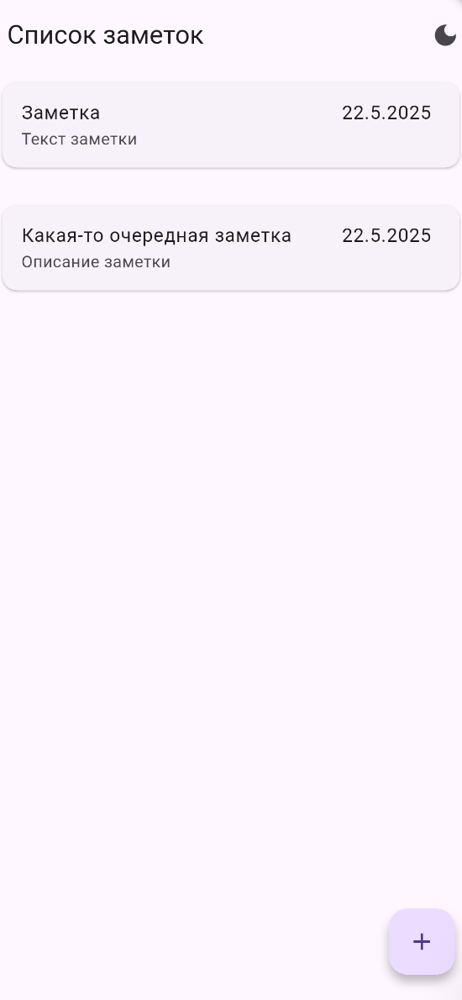
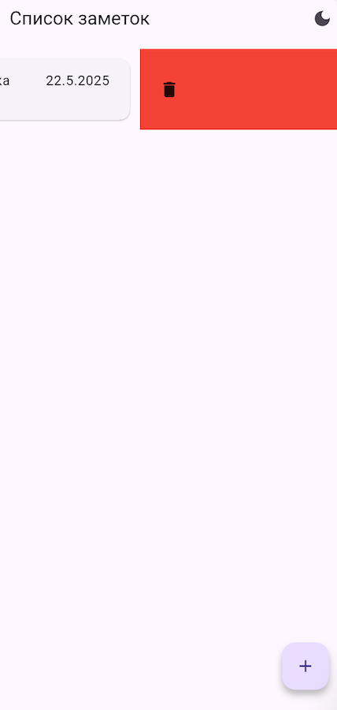
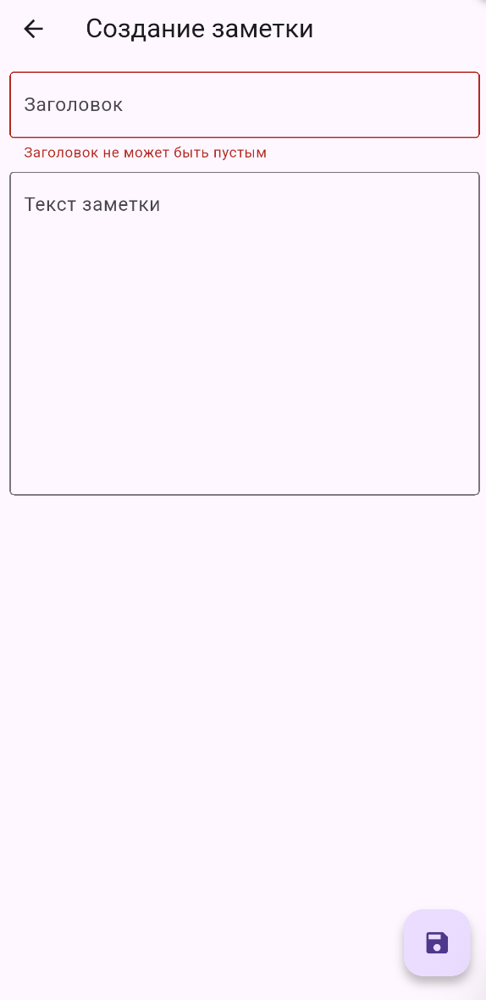

# Note Proviante

Простое приложение для создания и редактирования заметок

## Архитектура проекта

Проект построен с использованием чистой архитектуры (Clean Architecture) и следует принципам SOLID. Структура проекта разделена на следующие слои:

### 1. Core
- Реализация Dependency injection
- Собственное логирование приложение
- Базовые классы и интерфейсы хранилищ данных

### 2. Domain
- Бизнес-логика приложения
- Модели данных

### 3. Data
- Реализация репозитория для поставки заметок из хранилища

### 4. Feature
- Экраны приложения
- Темы приложения
- Состояние UI (используя Provider)

## Используемые технологии и библиотеки

- **Provider** - для управления состоянием
- **Shared Preferences** - для локального хранения данных
- **Logger** - для логирования
- **UUID** - для генерации уникальных идентификаторов
- **JSON Serializable** - для сериализации/десериализации данных

## Скриншоты приложения
### Главный экран

### Создание заметки

### Удаление заметки

### Смена темы

### Валидация

